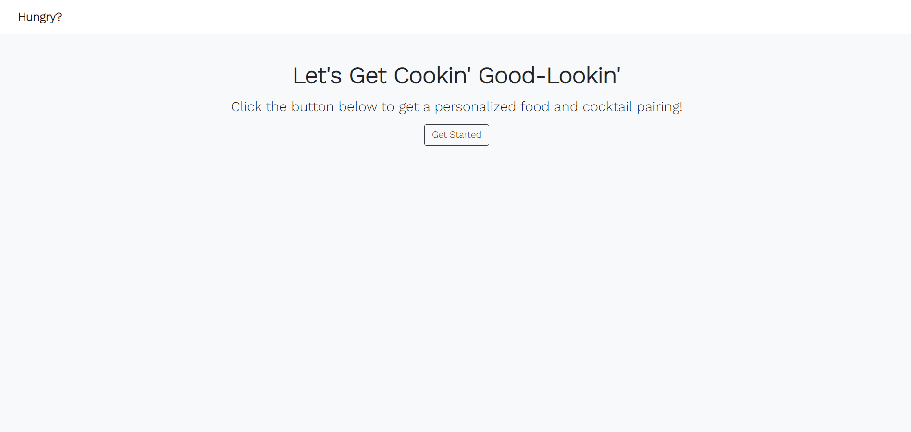
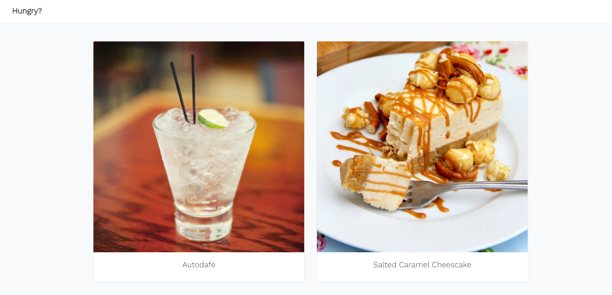

# Hungry? - The Happy Hour Pairing Generator
  

  ## Description
  This application is designed to append food and beverage pairings based on user input to curate the happiest of hours. Designed with two API's, theMealDB and theCocktailDB, this application collects user data via a drop down list, and queries the database food and drink options within the selected criteria, and renders a randomized reccomendation to the user.

  
  

  ## Table of Contents
  * [Installation](#installation)
  * [Usage](#usage)
  * [Tests](#tests)
  * [Contributing](#contributing)
  * [License](#license)
  * [Questions](#questions)

  ## Installation
  N/A

  ## Usage
  To access this application, simply follow the link below!
  [DIY Happy Hour](https://t-starkw.github.io/diy-happy-hour/)

  * Click the start button
  * Select your alcohol of choice from the drop-down list
  * Choose a food category
  * View your results!

  ## Tests
  N/A

  ## Contributing
  N/A

  ## License
  
  
  https://opensource.org/licenses/MIT 
    

  ## Questions
  GitHub: [t-starkw](https://github.com/t-starkw)  
  Email: tstark@gmail.com